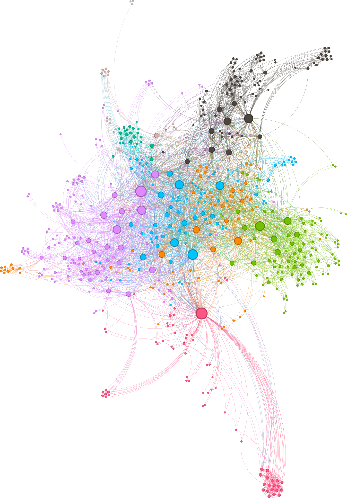

## 🗓️ Week 11 – Applications II: text mining  <span style='color:#eaeaea'>\& network analysis</span>

DS105L – Data for Data Science

**AUTHOR:**  Dr. [Jon Cardoso-Silva](https://www.lse.ac.uk/DSI/People/Jonathan-Cardoso-Silva)

**DEPARTMENT:** [LSE Data Science Institute](https://twitter.com/lsedatascience)

**DATE:** 31 March 2023

_"Ugh! Why is this a full GitHub repository and not just a `.ipynb` to download?" I hear you ask. So that you can practice with `git` and `GitHub`!_




### 🐍 The Python setup

1. Install [Python 3.9](python.org) or higher on your computer.
2. Install [anaconda](https://www.anaconda.com/products/individual) or [miniconda](https://docs.conda.io/en/latest/miniconda.html) on your computer.
3. Create a new conda environment:

    ```bash
    conda create -y -n=venv-ds-105 python=3.10.8
    ```
4. Activate the environment and make sure you have `pip` installed inside that environment:

    ```bash
    # the exact `activate` command will vary depending on your OS
    conda activate venv-ds-105 
    ```

💡 Remember to activate this particular `conda` environment whenever you reopen VSCode/the terminal.

10. Install required libraries

    ```bash
    pip install -r requirements.txt
    ```

Now, whenever you open a Jupyter Notebook, you should see the `venv-ds-105` kernel available. 

